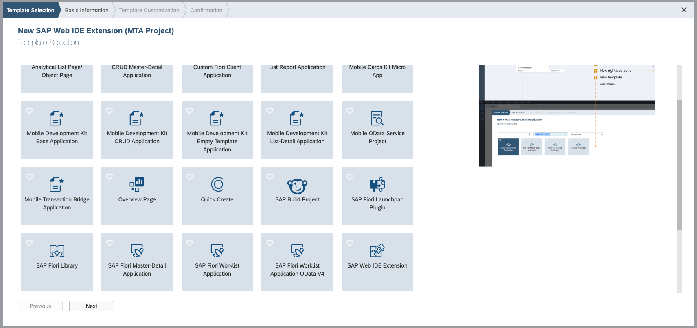
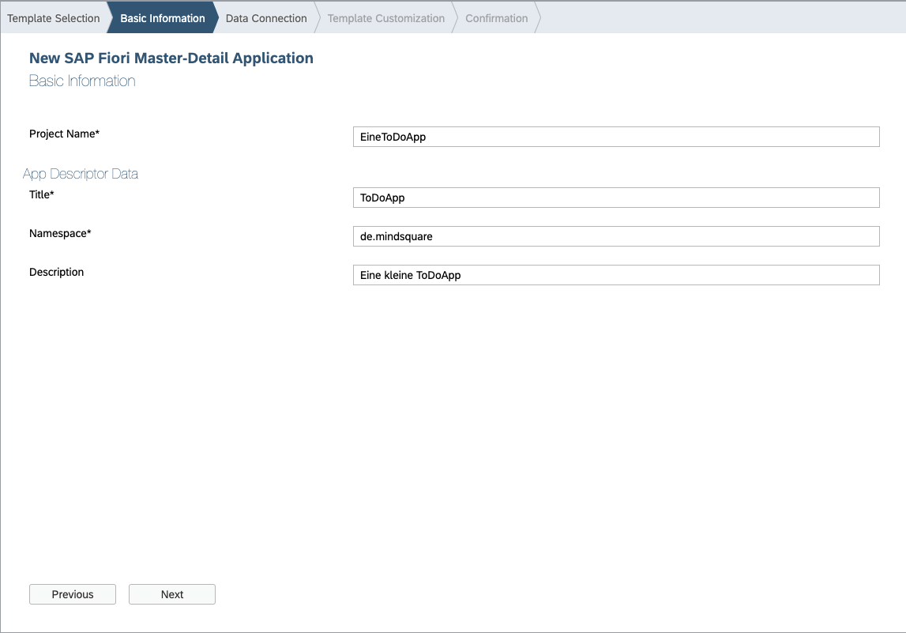
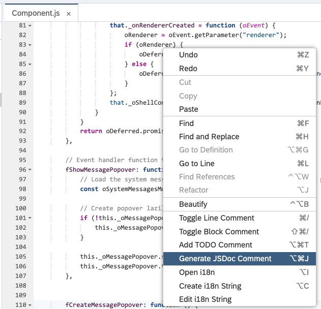
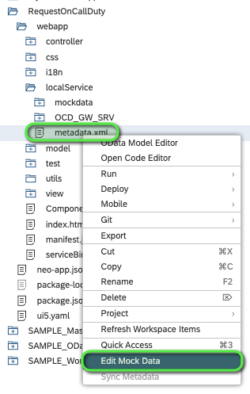

<p align="center">
  
</p>

# SAPUI5 - Best Practices

Dies ist eine Sammlung von Best Practices in der SAPUI5 Programmierung. Angefangen vom initialen Projektsetup bis hin zu fortgeschrittenen Konzepten findet sich hier alles. Dieser Guide wird im Laufe der Zeit beständig erweitert - also dran bleiben!

## Inhaltsverzeichnis

- [SAPUI5 Best Practices](#sapui5-best-practices)
  - [Inhaltsverzeichnis](#inhaltsverzeichnis)
    - [1. Projektsetup](#1-projektsetup)
      - [1.1 Ordnerstruktur](#11-ordnerstruktur)
        - [1.1.1 root Ordner](#111-root-ordner)
        - [1.1.2 webapp Ordner](#112-webapp-ordner)
        - [1.1.3 test Ordner](#113-test-ordner)
        - [1.1.4 Weitere Ordner](#114-weitere-ordner)
          - [view Ordner](#view-ordner)
          - [controller Ordner](#controller-ordner)
          - [model Ordner](#model-ordner)
          - [i18n Ordner (Localization)](#i18n-ordner-localization)
          - [localService Ordner](#localservice-ordner)
      - [1.2 Templates nutzen](#12-templates-nutzen)
      - [1.3 Projektname & Namespaces](#13-projektname--namespaces)
    - [2. Coding Guidelines](#2-coding-guidelines)
      - [2.1 Allgemeine Guidelines](#21-allgemeine-guidelines)
      - [2.2 Variablen](#22-variablen)
    - [3. Entwicklungskonventionen einer UI5-App](#3-entwicklungskonventionen-einer-ui5-app)
      - [3.1 Bootstrapping](#31-bootstrapping)
      - [3.2 Verwendung einer Component.js](#32-verwendung-einer-componentjs)
      - [3.3 manifest.json pflegen](#33-manifestjson-pflegen)
      - [3.4 MVC - Pattern](#34-mvc---pattern)
      - [3.5 MVC Namenskonventionen](#35-mvc-namenskonventionen)
      - [3.6 Data Binding](#36-data-binding)
        - [3.6.1 Binding-Modes](#361-binding-modes)
        - [3.6.2 Binding Arten](#362-binding-arten)
      - [3.7 Formatierung & Custom Formatter](#37-formatierung--custom-formatter)
      - [3.8 Weiteres zu Models](#38-weiteres-zu-models)
        - [3.8.1 Modeltypen und Verwendung](#381-modeltypen-und-verwendung)
        - [3.8.2 Lesen/Ändern von Modeldaten](#382-lesen%c3%84ndern-von-modeldaten)
        - [3.8.3 createKey() benutzen](#383-createkey-benutzen)
      - [3.9 Internationalisierung](#39-internationalisierung)
      - [3.10 Routing](#310-routing)
        - [3.10.1 Allgemeine Konventionen](#3101-allgemeine-konventionen)
        - [3.10.2 Abfangen ungültiger Hashes](#3102-abfangen-ung%c3%bcltiger-hashes)
        - [3.10.3 Nutzung von Parametern beim Routing](#3103-nutzung-von-parametern-beim-routing)
        - [3.11 Error Handling](#311-error-handling)
      - [3.12 Validierung](#312-validierung)
      - [3.13 ESLINT Hinweise beachten](#313-eslint-hinweise-beachten)
    - [4. Quickwins](#4-quickwins)
      - [4.1 SAPUI5 Shortcuts](#41-sapui5-shortcuts)
      - [4.2 Mock-Daten ohne Backend nutzen](#42-mock-daten-ohne-backend-nutzen)
    - [5. Fortgeschrittene Konzepte](#5-fortgeschrittene-konzepte)
      - [5.1 Modularisierung](#51-modularisierung)
        - [5.1.1 View-Fragments](#511-view-fragments)
        - [5.1.2 Formatter](#512-formatter)
        - [5.1.3 Utilities](#513-utilities)
      - [5.2 Nutzung von Models (z.B. Device Model)](#52-nutzung-von-models-zb-device-model)
      - [5.3 Performanceverbesserung](#53-performanceverbesserung)
        - [5.3.1 Lazy Loading beim Routing](#531-lazy-loading-beim-routing)
        - [5.3.2 Component-preload.js](#532-component-preloadjs)
      - [5.4 Testmanagement](#54-testmanagement)
      - [5.5 Sichere UI5-Apps](#55-sichere-ui5-apps)
      - [5.6 Erweiterungsmanagement](#56-erweiterungsmanagement)
      - [5.7 Eigene Controls Entwickeln](#57-eigene-controls-entwickeln)
      - [5.8 Theming von UI5-Apps](#58-theming-von-ui5-apps)
      - [5.9 Mit Git arbeiten](#59-mit-git-arbeiten)

### 1. Projektsetup

Beschreibt den grundsätzlichen Aufbau einer UI5-App und wie dieser am besten strukturiert wird.

#### 1.1 Ordnerstruktur

Die nachfolgende Ordnerstruktur ist die Best Practice im Aufbau einer UI5 mit **einer** Component, **einem** OData-Service und **weniger als** 20 Views.
Sobald diese Anforderungen nicht mehr zutreffen, sollten weitere Unterordner eingeführt werden, um die App noch weiter zu unterteilen.

<p align="center">
  
</p>

##### 1.1.1 root Ordner

Enthält Dateien, die **nicht** Teil des Codes sind. Dazu gehören Build-Konfigurationen (**Gruntfile.js**), sowie Dokumentationsdateien (**README.md**).
Kann bei Bedarf noch weiter unterteilt werden.

##### 1.1.2 webapp Ordner

Beinhaltet für die App relevanten Code-Files. Alle Dateien, die lediglich für das Testen der App relevant sind sind im **test Ordner** abzulegen.

Zudem strukturiert der webapp Ordner die Anwendung gemäß dem MVC-Pattern.

##### 1.1.3 test Ordner

Hier werden alle Dateien abgelegt, die für automatische Tests notwendig sind, oder um die Anwendung innerhalb der Sandbox auszuführen, um manuelle Tests machen zu können.

##### 1.1.4 Weitere Ordner

Neben diesen drei Hauptordnern, gibt es folgende weitere Ordner.

###### view Ordner

Beinhaltet alle Views und Fragmente der App. Außer JavaScript Views darf hier **keine JavaScript-Logik** enthalten sein. Die Unterteilung hierbei ist jedem selbst überlassen. Eine Möglichkeit ist, für Fragments einen eigenen Ordner anzulegen. Wenn es sich um eine größere App handelt, dann kann für jeden Bereich der App ein eigener Unterordner angelegt werden (detail, master, etc.).

###### controller Ordner

Hier werden alle controller Dateien abgelegt, welche von den Views genutzt werden. Auch übergreifend benutzte Dateien (BaseController, externe Libraries, etc.) werden hier abgelegt.

###### model Ordner

Beinhaltet alle Dateien der Model-Generierung und Model-Logik (z.B. Grouping, Formatting und Filtering).

###### i18n Ordner (Localization)

Hier werden die Internationalisierungsdateien abgelegt.

###### localService Ordner

Genutzt, um OData-Services für Tests zu emulieren oder für Preview-Modus der App. Beinhaltet außerdem die **metadata.xml** Datei, welche den angebundenen OData-Service der Anwendung beschreibt.

#### 1.2 Templates nutzen

Für die Erstellung der wichtigsten App-Layouts bietet die SAP über die Web IDE die Möglichkeit App-Templates zu benutzen.

<p align="center">
  
</p>

Über den Wizard kann aus einer Vielzahl von vorgefertigten Templates ausgewählt werden.

<p align="center">
  
</p>

#### 1.3 Projektname & Namespaces

Der Projektname darf maximal 15 Zeichen lang sein. Das ist eine durch das ABAP Repository vorgegeben Restriktion.

Für den Namespace der App bitte an die [Reverse-DNS Notation](https://en.wikipedia.org/wiki/Reverse_domain_name_notation) halten und diesen ebenfalls sprechend benennen
und wenn möglich auf drei Segmente beschränken.

_Schlecht:_

```
test.kundenname.eineapp.de // Zu viele Segmente, keine Reverse-DNS Notation
```

_Gut:_

```
de.mindsquare.superapp
```

Wenn ein neues Projekt angelegt wird, sind die Informationen wie folgt im Wizard einzutragen:

<p align="center">
  
</p>

Damit wird der folgende Namespace generiert:

```
de.mindsquare.EineToDoApp
```

### 2. Coding Guidelines

Für die UI5 Programmierung gelten die nachfolgenden Coding Guidelines. Es ist sicherzustellen dass diese eingehalten werden,
sodass das Coding sauber und einheitlich bleibt.

#### 2.1 Allgemeine Guidelines

1. Keine globalen Variablen verwenden - kann zu ungewolltem Verhalten führen
2. Keine privaten Elemente und Funktionen von Objekten benutzen (erkennbar durch einen voranstehenden `_`)
3. Kein `console.log()` benutzen (bzw. nur zu Testzwecken) - besser ist `sap.base.Log`
4. Nutzung von JSDoc-Kommentaren

<p align="center">
  
</p>

Das erzeugte Kommentar sieht wie folgt aus:

<p align="center">
  
</p>

#### 2.2 Variablen

Variablen in SAPUI5 beginnen mit einem kurzen Indikator der auf den Typ der Variablen schließen lässt. Anschließend sind **sprechende** Variablennamen und **CamelCasing** zu verwenden.

Anbei eine Übersicht der verschiedenen Typen.

| Beispiel        | Typ                |
| --------------- | ------------------ |
| **s**Id         | String             |
| **o**DomRef     | Objekt             |
| <b>$</b>DomRef  | jQuery Objekt      |
| **i**Count      | Integer            |
| **m**Parameters | Map                |
| **a**Entries    | Array              |
| **d**Today      | Datum              |
| **f**Decimal    | Float              |
| **b**Enabled    | Boolean            |
| **r**Pattern    | Regular Expression |
| **fn**Function  | Funktion           |
| **v**Variant    | Variant Types      |

Anbei noch Beispiele für gute und schlechte Variablennamen:

_Schlecht:_

```javascript
var name = "Florian"; // kein Typ-Indikator
var sId = 123; // falscher Typ
var a = "Eine nichtssagende Variable";
```

_Gut:_

```javascript
var sFirstName = "Florian";
var iCounter = 1;
var bRequestEdited = true;
```

### 3. Entwicklungskonventionen einer UI5-App

Nachfolgende Entwicklungskonventionen stellen sicher, dass die zu entwickelnde App allgemeinen Gütekriterien der Entwicklung entspricht.
**Wartbarkeit**, **Lesbarkeit**, **Nachvollziehbarkeit** sowie **Sicherheit** sind durch die Einhaltung gegeben.

#### 3.1 Bootstrapping

Bootstrapping bedeutet das Laden und die Initialisierung der SAPUI5 Runtime für die App.

Die Standard-Variante sieht wie folgt aus und wird innerhalb der **_index.html_** Datei eingebunden:

```javascript
<script
  id="sap-ui-bootstrap"
  src="resources/sap-ui-core.js"
  data-sap-ui-theme="sap_belize"
  data-sap-ui-async="true"
  data-sap-ui-compatVersion="edge"
  data-sap-ui-onInit="module:my/app/main"
  data-sap-ui-resourceRoots='{"my.app": "./"}'
></script>
```

Weitere Infos können [hier](https://sapui5.hana.ondemand.com/#/topic/a04b0d10fb494d1cb722b9e341b584ba) nachgelesen werden.

#### 3.2 Verwendung einer Component.js

Um die App später ins SAP Launchpad einbinden zu können, ist die App innerhalb einer Component zu kapseln. Unabhängig, ob das der Fall ist oder nicht, sollte stets eine
Component verwendet werden. Die Alternative hierzu ist die **_index.html_** Datei, über welche die App als Direktlink aufgerufen werden kann. Die unter Punkt [1.2](#12-templates-nutzen) erwähnten Templates erstellen die Component automatisch mit.

Die Component wird innerhalb der `Component.js` Datei erstellt.

#### 3.3 manifest.json pflegen

Die `manifest.json` Datei ist die zentrale Konfigurationsdatei für die App und wird bei der Erstellung der Component geladen und angewendet:

```javascript
	return UIComponent.extend("de.mindsquare.meineApp.Component", {

		metadata: {
			manifest: "json" // Lade manifest.json
		},

    // Weitere Initilisierung der Component

		}
	});
```

Alle Konfigurationen, die hierüber zentral gepflegt werden können, sollten hier auch gepflegt werden. Dazu zählen folgende Punkte:

- Models
- Dependencies (Abhängigkeiten von anderen Libraries - SAPUI5, eigene Libraries, externe Libraries)
- Routing-Konfiguration
- Andere Componenten, welche in der App verwende werden

Die zentrale Pflege erleichtert Wartbarkeit und Performance (weniger Ladezyklen innerhalb der App).

Models können zudem vorgeladen werden, dazu ist folgendes innerhalb der manifest.json zu hinterlegen:

```json
"sap.ui5": {
  ...
  "models": {
      "meinModel": {
          "preload": true,
          ...
```

#### 3.4 MVC - Pattern

Das MVC-Pattern trennt die Darstellung der Informationen innerhalb des UI (View) von der Datenhaltung (Model) und der App-Logik (Controller).

<p align="center">
  
</p>

Durch dieses Pattern kann die App in logische Bestandteile untergliedert werden, was die Übersichtlichkeit erhöht

#### 3.5 MVC Namenskonventionen

**Views**

Die Views einer Anwendung werden nach folgendem Schema benannt:

`<Viewname>.view.xml`

Best Practice ist die Verwendung von XML-Views aufgrund der deklarativen Natur. JSON und JavaScript- Views sind mit steigender Komplexität schlechter wartbar. Wie bei Variablen, sind auch hier **sprechende** Namen zu verwenden.

**Controller**

Controller werden wie folgt benannt:

`<Controllername>.controller.js`

Für eine leichtere Zuordnung zum View ist darauf zu achten, dass Views und der dazugehörige Controller stets **gleich** benannt werden.

Die einzige Außnahme stellt der BaseController dar, welcher wie folgt zu benennen ist:

`BaseController.js`

Sofern die gleiche Funktionalität über mehrere Controller hinweg genutzt wird, ist ein BaseController zu benuzten!

**Models**

**_i18n_**

Variablen im `i18n`-Model sind sprechend zu benennen, beginnen mit einem kleinen Buchstaben und es wird CamelCasing verwendet.

**_Weitere Models_**

Werden innerhalb einer App neben dem `Default`-Model weitere Models benutzt, so sind diese mit sprechenden Namen zu versehen. Der Name muss einen klaren Hinweis auf den Verwendungsbereich des Models geben.

#### 3.6 Data Binding

##### 3.6.1 Binding-Modes

Zunächst ist zu prüfen, welcher Binding-Mode verwendet werden soll:

**One-Way binding:** Änderungen am Model werden an gebundene Controls weitergegeben. Änderungen an den Controls jedoch nicht ans Model.

**Two-Way binding:** Werte in Model und in Cotrols sind immer synchronisiert.

**One-Time binding:** Werte aus dem Model werden einmalig an den View transportiert. Weitere Änderungen werden weder im Model noch im View dargestellt!

Übersicht der Binding-Modes in verschiedenen Modeltypen:

| Modeltyp        | One-Way | Two-Way | One-Time | Default  |
| --------------- | ------- | ------- | -------- | -------- |
| JSON            | X       | X       | X        | Two-Way  |
| XML             | X       | X       | X        | Two-Way  |
| OData (V2 & V4) | X       | X       | X        | One-Way  |
| Resource        | -       | -       | X        | One-Time |

##### 3.6.2 Binding Arten

Folgende Binding-Arten sind je nach Anwendungsfall zu benutzen:

**1. Property Binding**

Bindet Daten aus dem Model direkt an die Attribute eines Controls:

```javascript
// Binding im XML-View
<mvc:View
  controllerName="sap.ui.sample.App"
  xmlns="sap.m"
  xmlns:mvc="sap.ui.core.mvc"
>
  <Input value="{/company/name}" />
</mvc:View>
```

```javascript
// Binding bei Erstellung des Contorls innerhalb des Controllers
var oInput = new sap.m.Input({
  value: "{/company/name}",
});
```

**Zu beachten:** Grundsätzlich sollte immer der `Complex`-BindingMode im Bootstrapping aktiviert werden:

```javascript
<script
  id="sap-ui-bootstrap"
  src="https://openui5.hana.ondemand.com/resources/sap-ui-core.js"
  data-sap-ui-theme="sap_belize"
  data-sap-ui-bindingSyntax="complex" // Muss aktiviert sein!
  data-sap-ui-compatVersion="edge" // Alternativ kann auch dieses Attribut gesetzt werden
  data-sap-ui-async="true"
  data-sap-ui-onInit="module:sap/ui/sample/main"
  data-sap-ui-resourceRoots='{"sap.ui.sample": "./"}'
></script>
```

Der Complex-BindingMode erlaubt es weitere Bindings und auch Text hinzuzufügen:

```javascript
// Kombination verschiedener Bindings und Models zur Complex-BindingMode
<ObjectAttribute text="{i18n>title} {LastName}"></ObjectAttribute>
```

**2. Expression Binding**

Expression Binding kann erweiternd zum Property Binding genutzt werden, um basierend auf einem einfachen logischen Ausdruck (`true`/`false`) einen Attribut-Wert zu setzen.

Folgendes Beispiel zeigt, wie das Attribut `numberState` basierend auf dem Preis eines Items entweder den Status `Error` (wenn `true`) oder den Status `Success` (wenn `false`) zugewiesen bekommt:

```javascript
<ObjectListItem
  title="{invoice>Quantity} x {invoice>ProductName}"
  number="{
		  parts: [{path: 'invoice>ExtendedPrice'}, {path: 'view>/currency'}],
		  type: 'sap.ui.model.type.Currency',
		  formatOptions: {
			  showMeasure: false
		  }
		}"
  numberUnit="{view>/currency}"
  numberState="{= ${invoice>ExtendedPrice} > 50 ? 'Error' : 'Success' }"
/>
```

**3. Context Binding (Element Binding)**

Bindet ein Control an ein spezifisches Objekt innerhalb des Models und erstellt dabei einen sogenannten `BindingContext`. Innerhalb des gebundenen Controls und allen Subcontrols (Children) kann das Binding relativ zu diesem Kontext stattfinden.

Hilfreich in Master-Detail-Szenarien. Aus der Masterliste wird ein Eintrag ausgewählt, der anschließend gegen den Detail-Bereich gebunden wird. Somit wird das ausgewählte Item zum Kontext im Detail-Bereich und es kann auf Informationen relativ zu diesem Item zugegriffen werden.

Folgende Daten:

```json
{
	companies : [
		{
			name : "Acme Inc.",
			city: "Belmont",
			state: "NH",
			county: "Belknap",
			revenue : 123214125.34
		},{
			name : "Beam Hdg.",
			city: "Hancock",
			state: "NH",
			county: "Belknap"
			revenue : 3235235235.23
		},{
			name : "Carot Ltd.",
			city: "Cheshire",
			state: "NH",
			county: "Sullivan",
			revenue : "Not Disclosed"
		}]
}
```

Ein einfacher View:

```javascript
<mvc:View
  controllerName="sap.ui.sample.App"
  xmlns="sap.m"
  xmlns:mvc="sap.ui.core.mvc"
>
  <Input id="companyInput" value="{name}" />
</mvc:View>
```

Binding der ersten Company gegen das Input-Control des Views:

```javascript
var oInput = this.byId("companyInput");
oInput.bindElement("/companies/0"); // Hier binden wir den ersten Eitrag aus dem JSON-Model gegen das Input-Control
```

Hierdurch wird

```javascript
value = "{name}";
```

relativ zu dem gebundenen Modeleintrag aufgelöst und "Acme Inc." in das `value`-Attribut des Input-Feldes geschrieben.

**4. Aggregation Binding (List Binding)**

Diese Art des Bindings wird dann genutzt, wenn aus den Model-Daten mehrere Child-Controls zu einem übergeordneten Control ertellt werden sollen.

Auf die nachfolgende Weise können wir eine Liste von Unternehmen erstellen lassen:

Model-Daten:

```json
{
	companies : [
		{
			name : "Acme Inc.",
			city: "Belmont",
			state: "NH",
			county: "Belknap",
			revenue : "123214125.34"
		},{
			name : "Beam Hdg.",
			city: "Hancock",
			state: "NH",
			county: "Belknap"
			revenue : "3235235235.23"
		},{
			name : "Carot Ltd.",
			city: "Cheshire",
			state: "NH",
			county: "Sullivan",
			revenue : "Not Disclosed"
		}]
}
```

Der XML-View mit dem Binding:

```javascript
<mvc:View controllerName="sap.ui.sample.App" xmlns="sap.m" xmlns:mvc="sap.ui.core.mvc">
	<List id=”companyList” items="{path: '/companies', templateShareable:false}">
		<items>
			<StandardListItem title="{name}" description="{city}"/>
		</items>
	</List>
</mvc:View>
```

**Anmerkung:** `templateShareable` sorgt dafür, dass mit Auflösung des List-Controls seine Aggregationen ebenfalls mit aufgelöst werden. Stünde der Wert auf `true` müsste der Lifecycle der Aggregation manuell gepflegt werden.

#### 3.7 Formatierung & Custom Formatter

Wenn auf komplexere Formatierung von Attributen zurückgegriffen werden muss, dann sind Formatter zu verwenden.  
Hierzu kann eine separate `formatter.js` Datei angelegt werden, welche im `model`-Ordner oder einem separierten `utils`-Ordner abgelegt werden kann.

Die `formatter.js` Datei sieht wie folgt aus:

```javascript
sap.ui.define([], function () {
  "use strict";
  return {
    statusText: function (sStatus) {
      var resourceBundle = this.getView().getModel("i18n").getResourceBundle();
      switch (sStatus) {
        case "A":
          return resourceBundle.getText("invoiceStatusA");
        case "B":
          return resourceBundle.getText("invoiceStatusB");
        case "C":
          return resourceBundle.getText("invoiceStatusC");
        default:
          return sStatus;
      }
    },
  };
});
```

Um die Formatter-Funktionen im Controller und damit auch im View verfügbar zu machen, muss die `formatter.js`-Datei im Controller geladen werden. Um einfacher auf die Funktionen zuzugreifen, wird das zurückgegebene Objekt innerhalb des `formatter`-Attributs des Controllers gesichert:

```javascript
sap.ui.define(["../model/formatter"], function (formatter) {
  "use strict";
  return Controller.extend("de.mindsquare.DemoApp", {
    formatter: formatter, // Zuweisung des return-Objekts an das formatter-Attribut

    onInit: function () {
      // ...
    },
  });
});
```

Über `.formatter.statusText` können die Formatter-Funktionen nun auch im View genutzt werden. Der `.` meint, dass im Controller des Views nach der angegebenen Funktion gesucht werden soll:

```javascript
<List headerText="Header"
		  sitems="{invoice>/Invoices}">
		<items>
			<ObjectListItem
				title="Titel"
				numberState="{=	${invoice>ExtendedPrice} > 50 ? 'Error' : 'Success' }">
				<firstStatus>
					<ObjectStatus text="{
						path: 'invoice>Status',
						formatter: '.formatter.statusText'
					}"/>
				</firstStatus>
			</ObjectListItem>
```

#### 3.8 Weiteres zu Models

##### 3.8.1 Modeltypen und Verwendung

Folgende Modeltypen stehen in SAPUI5 zur Verfügung von welchen die rotmarkierten die wichtigsten darstellen:

<p align="center">
  
</p>

Client-seitig sollten hauptsächlich JSON- und Resource-Model (i18n - siehe Kapitel [3.9](#39-internationalisierung)) genutzt werden.

Server-seitig wird das ODataV2-Model eingesetzt.

Es spricht nichts dagegen mehrere Models innerhalb einer Anwendung zu benutzen. Jedem Model sollte allerdings eine klare Zuständigkeit zugesprochen werden.

Client-Models können innerhalb des `model`-Ordner der Anwendung angelegt werden. Bspw. ein separates ViewModel zur Steuerung der Sichtbarkeit von UI-Komponenten.

Weitere Modelfunktionalitäten sollten der `models.js` Datei im `model`-Ordner hinzugefügt und bei Bedarf in die Anwendung geladen werden.

##### 3.8.2 Lesen/Ändern von Modeldaten

Um das MVC-Konzept einzuhalten, ist nur über das Model auf die Daten zuzugreifen!

**_Im View_**

Innerhalb eines XML-Views sind die verschiedenen Binding-Arten aus Kapitel [3.6.2](#362-binding-arten). Hier ist abzuwägen, welcher Binding-Typ zu benutzen ist.

**_Im Controller_**

Sofern innerhalb des Controllers Modeldaten gelesen/bearbeitet werden, so ist dies über das Model selbst und den BindingContext zu machen:

```javascript
var oView = this.getView();
var oModel = oView.getModel();
var oCtx = oView.getBindingContext();

// Auslesen von Model-Daten
var sFirstName = oModel.getProperty("FirstName", oCtx);

// Setzen von Model-Daten
oModel.setProperty("LastName", "Müller", oCtx);
```

##### 3.8.3 createKey() benutzen

Zur Aufbereitung von Lesepfaden für das Model stets die Methode `createKey()` benutzen!

_Schlecht:_

```javascript
var oModel = this.getView().getModel();

// Pfadangabe hardgecoded - schlecht
var sPath = "/Products(ProductID1='foo',ProductID2='bar')";

// Lesen des Model-Pfads
oModel.read(sPath, {
  success: function (oData) {
    // Success-Handler
  },
  error: function (oData) {
    // Error-Handler
  },
});
```

_Gut:_

```javascript
var oModel = this.getView().getModel();

// Nutzung der createKey()-Methode
var sPath = oModel.createKey("/Products", {
  ProductID1: "foo",
  ProductID2: "bar",
});

// Lesen des Model-Pfads
oModel.read(sPath, {
  success: function (oData) {
    // Success-Handler
  },
  error: function (oData) {
    // Error-Handler
  },
});
```

#### 3.9 Internationalisierung

Sämtliche Bezeichnungen, Meldungen aller Art (Success, Error, etc.) und sonstige Texte werden in den `i18n`-Dateien gepflegt. Das sorgt dafür, dass Änderungen jederzeit schnell und einfach vorgenommen werden können und die Sprache problemlos gewechselt werden kann.

Für dynamische Texte, können Platzhalter im i18n-Text hinterlegt werden:

```javascript
helloMessage=Hallo {0}
```

Die Platzhalter werden durch einen übergebenen Array an die `getText()`-Methode der Reihenfolge nach befüllt:

```javascript
onShowHello : function () {
         // Lese ResourceBundle
         var oBundle = this.getView().getModel("i18n").getResourceBundle();
         var sRecipient = "Max Mustermann";
         var sMsg = oBundle.getText("helloMsg", [sRecipient]);
         // Zeige Nachricht in einem MessageToast
         MessageToast.show(sMsg);
      }
```

#### 3.10 Routing

##### 3.10.1 Allgemeine Konventionen

Routing-Funktionalitäten (`getRouter`, `navBack`, etc.) sind in den BaseController zu verlagern, um Code-Dopplungen zu vermeiden.
Routen und Targets innerhalb der `manifest.json` sind sprechend zu benennen!

##### 3.10.2 Abfangen ungültiger Hashes

Ungültige Hashes können über eine zusätzliche Konfiguration innerhalb der `manifest.json`-Datei abgefangen werden:

```javascript
{
  // ...
   "sap.ui5": {
      // ...
      "routing": {
         "config": {
            "routerClass": "sap.m.routing.Router",
            "viewType": "XML",
            "viewPath": "sap.ui.demo.nav.view",
            "controlId": "app",
            "controlAggregation": "pages",
            "transition": "slide",
            "bypassed": { // Abfangen ungültiger Hashes
               "target": "notFound"
            },
            "async": true
         },
         "routes": [{
            "pattern": "",
            "name": "appHome",
            "target": "home"
         }],
         "targets": {
            "home": {
               "viewId": "home",
               "viewName": "Home",
               "viewLevel" : 1
            },
            "notFound": {
               "viewId": "notFound",
               "viewName": "NotFound",
               "transition": "show"
            }
         }
      }
   }
}
```

##### 3.10.3 Nutzung von Parametern beim Routing

Für das Routing können `{Pflichtparameter}` als auch `:optionale Parameter:` spezifiziert werden:

```javascript
{
   // ...
   "sap.ui5": {
      // ...
      "routing": {
         "config": {
            "routerClass": "sap.m.routing.Router",
            "viewType": "XML",
            "viewPath": "sap.ui.demo.nav.view",
            "controlId": "app",
            "controlAggregation": "pages",
            "transition": "slide",
            "bypassed": {
               "target": "notFound"
            },
            "async": true
         },
         "routes": [{
            "pattern": "employeeDetails/{employeeId}", // Pflichtparameter
            "name": "employeeDetails",
            "target": "employeeDetails"
         }],
         "targets": {
            "employeeDetails": {
               "viewId": "employeeDetails",
               "viewName": "EmployeeDetails",
               "viewLevel": 1
            },
            "notFound": {
               "viewId": "notFound",
               "viewName": "NotFound",
               "transition": "show"
            }
         }
      }
   }
}
```

Um aus einem anderen View nun zum EmployeeDetails-View zu navigieren, ist folgender Aufruf zu programmieren:

```javascript
// Im Controller des Quell-Views
this.getRouter().navTo("employee",{
				employeeId : ... // Wie auch immer der Parameter bestimmt wird
			});
```

Innerhalb des EmplyeeDetails-Controllers ist die Navigation nun wie folgt zu bearbeiten:

```javascript
onInit: function () {
			var oRouter = this.getRouter();
			oRouter.getRoute("employee").attachMatched(this._onRouteMatched, this);
    },

_onRouteMatched : function (oEvent) {
      // Auslesen der übergebenen Parameter (hier: employeeId)
			var oArgs = oEvent.getParameter("arguments");
			var oView = this.getView();

      // Binden der Employee-Details gegen den View (GET_ENTITY Aufruf)
			oView.bindElement({
				path : "/Employees(" + oArgs.employeeId + ")",
				events : {
					change: this._onBindingChange.bind(this),
					dataRequested: function (oEvent) {
						oView.setBusy(true);
					},
					dataReceived: function (oEvent) {
						oView.setBusy(false);
					}
				}
			});
		},
```

##### 3.11 Error Handling

Error Handling kann an vielen Stellen relevant werden. Am wichtigsten jedoch, wenn Fehler bei einem OData-Aufruf aufgetreten sind.

Fehlerbehandlung ist sowohl innerhalb der `success`-Handler als auch der `error`-Handler-Callbackfunktion relevant.

```javascript
saveRequest: function () {
			// Abschicken des Requests
			this.getView().getModel().submitChanges({
				success: function (oData, oResponse) {

          // Prüfung der Response
					if (typeof oResponse !== "undefined" && oResponse.statusCode !== "200") {
            // Fehler in Backend aufgetreten
						this.parseErrorMessage(oResponse.body);
					} else {
						// Erfolgreichen Request verarbeiten
					}
				}.bind(this),
				error: function () {
          // Es konnte keine Verbindung zum Backend hergestellt werden - Error Handling
				}.bind(this)
      });
}

parseErrorMessage: function (oResponse) {
      // Response in JSON-Format konvertieren
			var oResponseJSON = JSON.parse(oResponse.body);
      var sMessageError = oResponseJSON.error.message.value;

      // Fehlermeldung weiter bearbeiten
}
```

#### 3.12 Validierung

Hier gibt es keine wirklichen Best Practices.
Für die grundsätzliche Validierung von Feldern, die als `required` gekennzeichnet sind, kann der [**_mindsquare Validator_**](../9_modules/mindsquareValidator.js) genutzt werden. Diesem kann ein Control jeglicher Art übergeben werden, welches anschließend rekursiv alle darin enthaltenen Pflichtfelder auf einen Inhalt bzw. ein Binding validiert.

Custom-Validierungen müssen separat und zusätzlich validiert werden.

Weiterhin ist **unbedingt** auf eine zusätzliche Validierung im SAP-Backend zu achten! Über den Debugger können Werte aus dem Frontend bearbeitet und falsch an das Backend übermittelt werden. Daher sollte in jedem Fall und mindestens im Backend eine Validierung der Werte stattfinden.

#### 3.13 ESLINT Hinweise beachten

Innerhalb der Web IDE können wichtige Hinweise zum Coding eingesehen werden, welche über den "Problems"-Tab in der rechten unteren Ecke aufgerufen werden können (siehe Bild).

<p align="center">
  
</p>

Die Hinweise werden in drei übergeordnete Kategorien eingeteilt:

- <span style="color:red">Errors</span>
- <span style="color:orange">Warnings</span>
- <span style="color:blue">Infos</span>

Zu jedem Hinweis gibt es eine Verlinkung zur Coding stelle, sowie eine Beschreibung. Über die Beschreibung kann zudem zur `ESLINT-Regel` abgesprungen werden, um mehr über den Hinweis zu erfahren.

Interessant ist zudem die Spalte `Category`. Hier sollte unter anderem auf die Kategorie "Best Practice" geachtet werden, um den Code sauber und strukturiert zu halten.

### 4. Quickwins

#### 4.1 SAPUI5 Shortcuts

[Link 1:](https://inui.io/sap-web-ide-shortcuts/)
[Link 2:](https://activate-hr.de/allgemein/was-das-geht-auch-shortcuts-im-sapui5-frontend-und-backend/)

#### 4.2 Mock-Daten ohne Backend nutzen

Innerhalb einer UI5-App können ohne großen Aufwand Mock-Daten erstellt werden. Hierzu ist im `localService`-Ordner zunächst eine `metadata.xml`-Datei anzulegen (manuell), welche die Beschreibung des OData-Services beinhaltet. Anschließend können die Mock-Daten über die beiden nachfolgenden Schritte erstellt werden:

<p align="center">
  
</p>

Mock-Daten können auch randomisiert erstellt werden:

<p align="center">
  
</p>

### 5. Fortgeschrittene Konzepte

#### 5.1 Modularisierung

##### 5.1.1 View-Fragments

##### 5.1.2 Formatter

##### 5.1.3 Utilities

#### 5.2 Nutzung von Models (z.B. Device Model)

#### 5.3 Performanceverbesserung

##### 5.3.1 Lazy Loading beim Routing

##### 5.3.2 Component-preload.js

[Component-preload.js](https://blogs.sap.com/2017/09/16/component-preload.jsminification-and-uglification-for-enhancing-the-performance-of-sapui5-application/)

#### 5.4 Testmanagement

#### 5.5 Sichere UI5-Apps

#### 5.6 Erweiterungsmanagement

#### 5.7 Eigene Controls Entwickeln

#### 5.8 Theming von UI5-Apps

#### 5.9 Mit Git arbeiten
