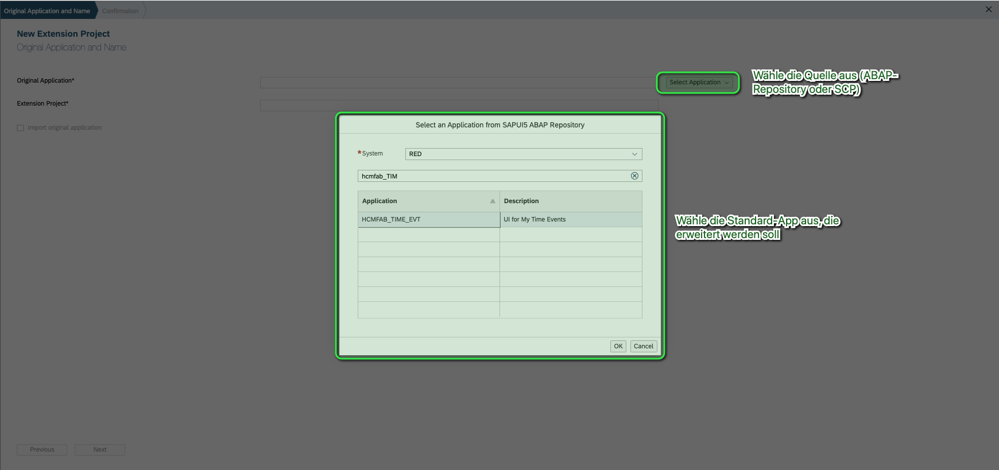
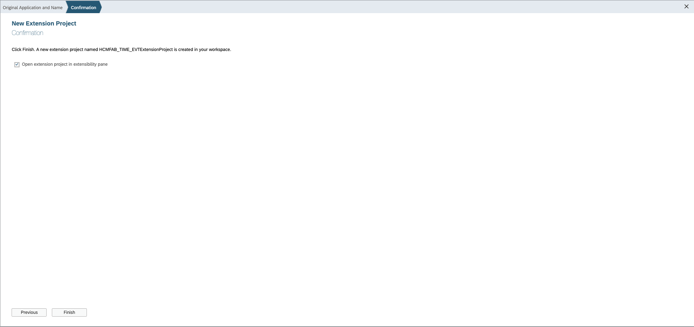
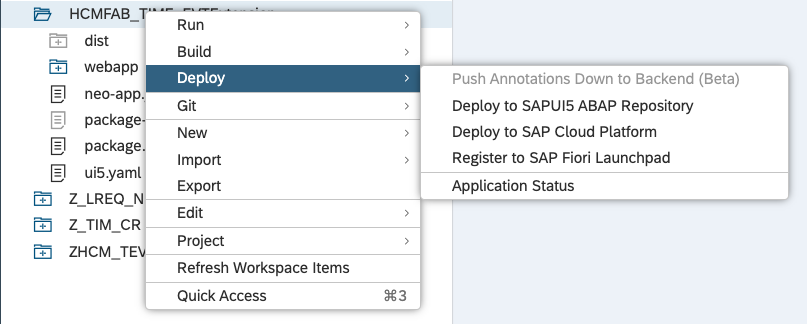
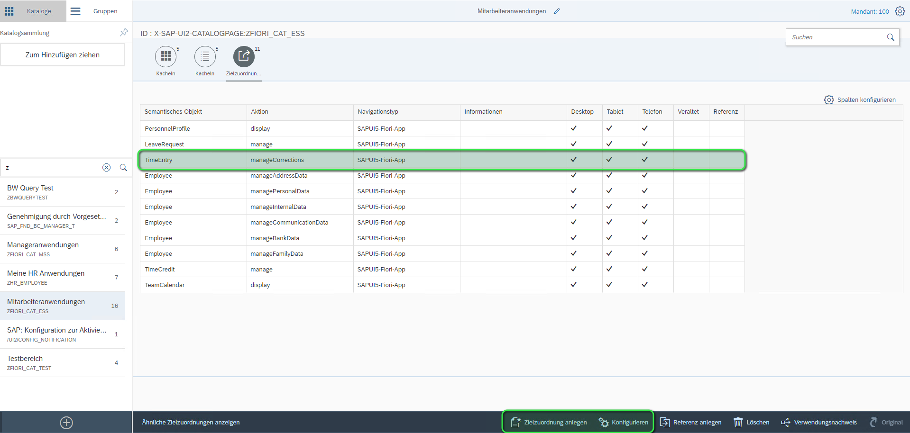
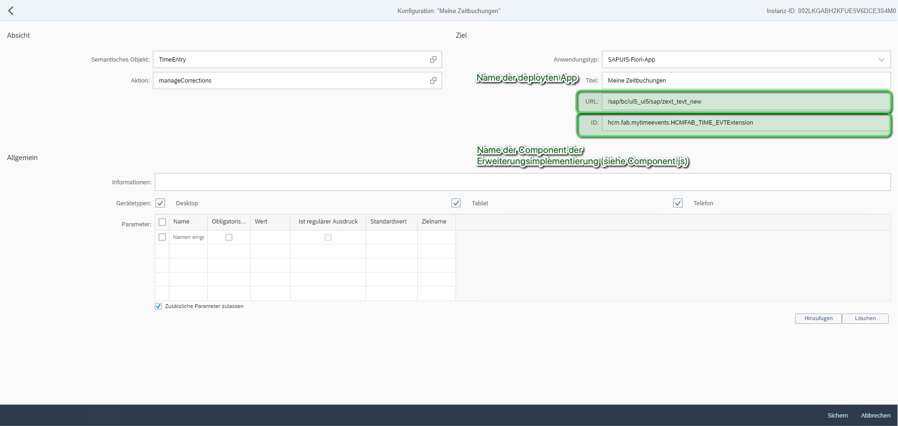
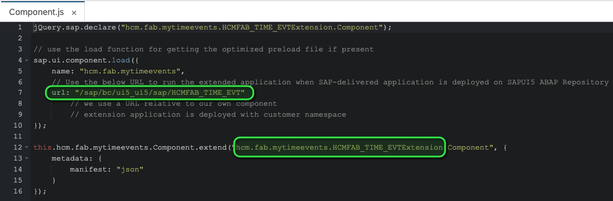

# Erweiterungen im Frontend
In diesem Teil des Guides wird Dir zunächst gezeigt, wie Du ein Erweiterungsprojekt als Grundlage für die Erweiterungen innerhalb der WebIDE anlegst.
Anschließend werden Dir die verschiedenen Möglichkeiten aufgzeigt, wie und welche Erweiterungen Du vornehmen kannst.

## Ein Erweiterungsprojekt für eine App anlegen
Über den Startbildschirm der WebIDE kann ein neues Erweiterungsprojekt angelegt werden:

  

Im erscheinenden Wizard ist zunächst die Quelle der zu erweiternden App auszuwählen. Die Auswahl richtet sich danach, wo die Apps liegen - entweder auf dem SAP Gateway System (ABAP-Repository) oder der SAP Cloud Platform. Wurde die Quelle ausgewählt, ist die App auszuwählen, für die das Erweiterungsprojekt angelegt werden soll:

  

Anschließend muss dem zu erstellenden Erweiterungsprojekt ein Name gegeben werden. Du kannst Dich zudem dazu entscheiden, neben dem Erweiterungsprojekt auch die Originalanwendungen in Deinen Workplace der WebIDE zu laden. 

  

Abschließend kannst Du im Confirmation-Fenster bestimmen, ob nach Anlage des Erweiterungsprojekts die sogenannte *Extensibility Pane* in der WebIDE geöffnet werden soll. Das ist kleines Schmankerl-Tool der WebIDE, mit der Du schnell und einfach die Erweiterungsspots innerhalb der zu erweiternden App ausfindig machen kannst.

  

Unabhängig davon, ob Du die Extensibility Pane aufgerufen hast oder nicht, das Erweiterunsprojekt ist nun in Deinem Workplace vorhanden und steht für die weitere Bearbeitung bereit.

  

## Erweiterungsprojekt deployen
Bisher ist das Erweiterungsprojekt nur lokal in Deiner WebIDE vorhanden und ist dem SAP-System/der SCP noch nicht bekannt. Damit dies der Fall ist, muss das Erweiterungsprojekt einmal deployed werden. Gehe dazu wie folgt vor:

*Rechtsklick auf das Erweiterungsprojekt* => *Deploy* => *Ziel des Deployments auswählen*

  

Anschließend wirst Du gefragt, ob Du eine neue Applikation/ein neues Erweiterungsprojekt deplyoen möchtest, oder aber ein bestehendes aktualisieren möchtest. 

  

Für den Fall, dass Du eine neue Applikation deployst, gib ihr einen sprechenden Namen und wähle zudem das Paket aus (nur ABAP-Repository) in das die Applikation deployed werden soll. Wähle im nächsten Schritt noch den Transportauftrag aus und schließe den Vorgang anschließend ab.

  

Wenn es hingegen darum geht, dass ein bereits deploytes Erweiterungsprojekt aktualisiert werden soll, dann wähle lediglich die entsprechende Applikation aus und bestätige das Deployment der Anwendung.

  

## Erweiterungsprojekt in das Launchpad einbinden
Mit dem Deployment ist es aber leider immer noch nicht getan. Wir müssen die Erweiterunsimplementierung nun auch mit dem entsprechenden Laucnhpad und der Standardanwendung selbst verknüpfen. 

Gehe dazu in den Launchpad-Designer (SAP Gateway) oder innerhalb der SCP in den Portal-Service und navigiere zu folgendem Bildschirm für die erweiterte Anwendung. 

> **Hinweis**: Du kannst an dieser Stelle auch ein (noch) leeres Erweiterungsprojekt verwenden, und dessen ordentliche Einbindung in das Launchpad direkt einmal testen. Ist die Einbindung erfolgreich verlaufen, brauchst Du dich von nun an nur noch um das regelmäßige Deployment der Erweiterung kümmern. Die Änderungen durch die Erweiterung werden mit sofortiger Wirkung angewendet.

  

In der Pflege der Zielzuordnung sind die hier markierten Einträge wichtig. Diese verweisen auf die Erweiterungsimplementierung und rufen diese über das Launchpad auf.

  

Die beiden oberen Informationen kannst Du ganu einfach aus der `Component.js` deines erstellten Erweiterungsprojektes entnehmen.

  

